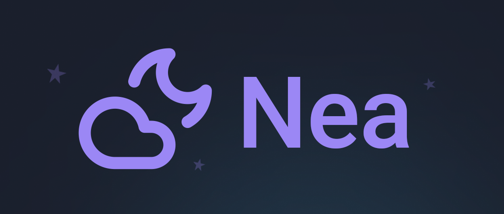

# Nea: Skip the Sleep Study!

  

    With Nea, we bring the sleep lab to <em>you</em>! 🥼
     
    <!-- <a href="https://github.com/samlyme/hacktech">View Demo</a> -->
    <!-- &middot; -->
    <!-- <a href="https://github.com/samlyme/hacktech/issues/new?labels=bug&template=bug-report---.md">Report Bug</a> -->
    <!-- &middot; -->
    <!-- <a href="https://github.com/samlyme/hacktech/issues/new?labels=enhancement&template=feature-request---.md">Request Feature</a> -->
  

## Inspiration

Despite their debilitating consequences, sleep apnea and other chronic sleep
disorders very frequently go undiagnosed due to the considerable inconvenience
and high cost of traditional sleep studies. ,With Nea, we provide a solution to
this problem that empowers individuals to monitor their sleep health from the
comfort of their own beds, using the devices they already own.

## What it does

Nea analyzes your overnight sleep sounds using advanced deep learning technology to identify snoring patterns, breathing abnormalities, and potential sleep apnea episodes. It provides detailed insights, trends, and a professional PDF report for collaboration with healthcare providers, giving you valuable information before committing to overnight lab studies.

## How we built it

> TODO: finish this list

We built Nea using a modern web stack:

- **Frontend**:
  - react
  - typescript
  - vite
  - tailwind css
  - radix ui
  - shacdn/ui
- **Backend**:
  - FastAPI
  - Railway VPS
  - PostgreSQL
  - SQLModel
- **Deep Learning**
  - Scikit-Learn
  - PyTorch
  - OpenCV
  - YOLO
  - PyEDFlib

## Challenges we ran into

- Converting video/audio files to normalized computer-readable formats
- Accounting for ambient noise in patient environment
- Converting RML into a text file and data frame for model training
- Implementing efficient data sampling and normalization for large audio datasets.
- Ensuring accurate detection of sleep events like snoring and breath obstructions.
- Handling file uploads and managing user account records efficiently.

## Accomplishments that we're proud of

- Successfully detecting and visualizing sleep events and possible episodes of
  sleep apnea with **{ THIS }%** accuracy.
- Creating a visually appealing and intuitive user interface.
- **ADD TWO MORE?**

## What we learned

- Backend is hard
- Reading documentation is hard
- File uploads are hard
- How to open/use a EDF/RML file
- How to use PyTorch
- How to do data analysis with Pandas
- How to convert video/audio files to csv and normalize the results

## What's next for Nea

- Camera features (allow users to record full length videos and improve model to
  account for sleep movements)
- Expanding insights to include more sleep health metrics.
- Partnering with healthcare providers to offer a seamless path to professional
  diagnosis and treatment.
- Developing a mobile app for easier recording and analysis.

# Sources

- [Sleep apnea: NHLBI sheds light on an underdiagnosed disorder](https://www.nhlbi.nih.gov/news/2017/sleep-apnea-nhlbi-sheds-light-underdiagnosed-disorder)
- [Undiagnosed and untreated sleep disorders: Barriers to care](https://aasm.org/undiagnosed-and-untreated-sleep-disorders-barriers-to-care/#:~:text=As%20a%20result%20of%20the,sleep%20disorder%20may%20go%20unnoticed.)
- [The Dangers of Uncontrolled Sleep Apnea](https://www.hopkinsmedicine.org/health/wellness-and-prevention/the-dangers-of-uncontrolled-sleep-apnea)
- [Sleep Apnea Tests and Diagnosis](https://www.webmd.com/sleep-disorders/sleep-apnea/diagnosing-sleep-apnea)
- [White Noise](https://mc2method.org/white-noise/)
